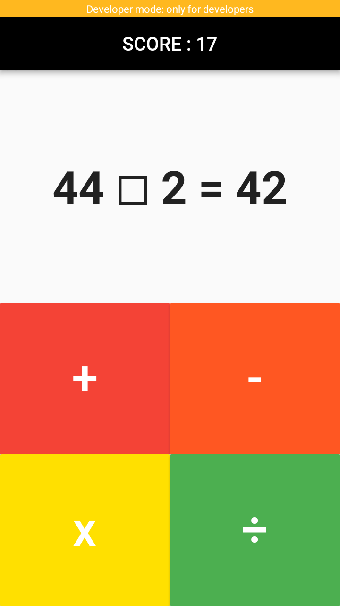
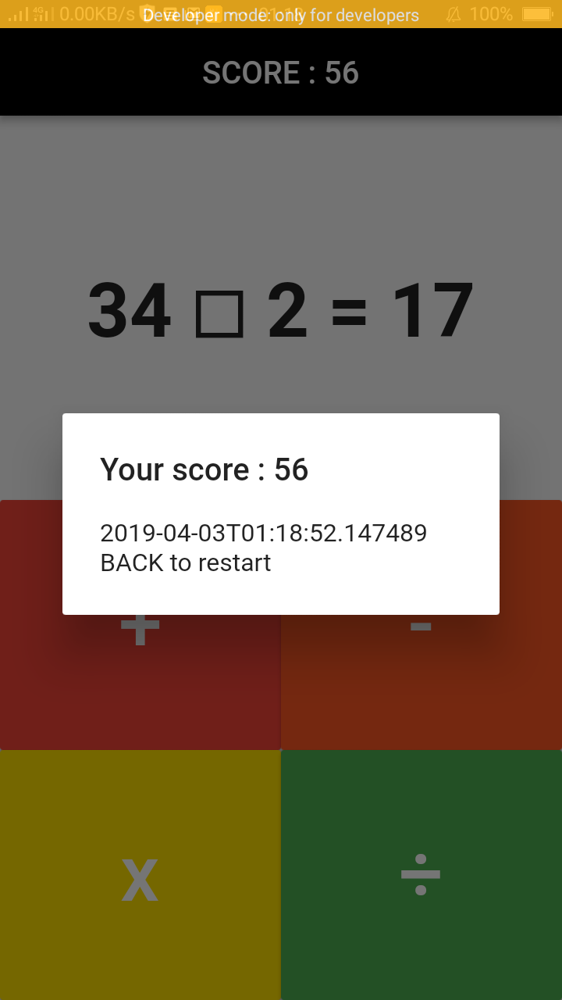

# FastMad

A Flutter 5kb dart application for \#FlutterCreate.

### Getting Started

This project is a starting point for a Flutter application.

A few resources to get you started if this is your first Flutter project:

- [Lab: Write your first Flutter app](https://flutter.io/docs/get-started/codelab)
- [Cookbook: Useful Flutter samples](https://flutter.io/docs/cookbook)

For help getting started with Flutter, view our 
[online documentation](https://flutter.io/docs), which offers tutorials, 
samples, guidance on mobile development, and a full API reference.

### Run the apps
Run `flutter run --release`
Support **iOS** and **Android**.
Volume on to have better experience.

## What is FastMad
FastMad is a simple math solving game, you won't get mad actually.

Press **'START'**.

Then just choose the right answer the fill in the box.

When answer wrong, the game end.
Score is calculate base on time, the lesser the time, the higher the score obtained.
